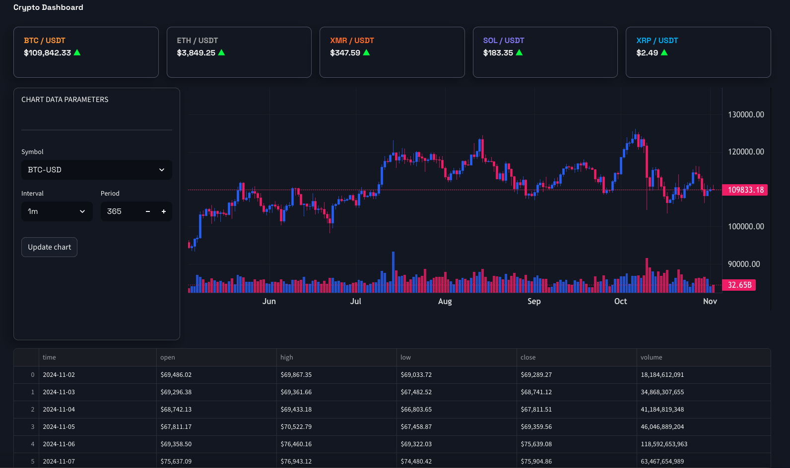

# Crypto Dashboard with Custom CSS in Streamlit

A Streamlit-based cryptocurrency dashboard featuring real-time crypto price data with custom CSS styling. This project demonstrates how to create a professional-looking dashboard using Streamlit with custom fonts, colors, and layouts.



## Features

- **Real-time Crypto Prices**: Display live prices for BTC, ETH, XMR, SOL, and XRP using DIA API
- **Professional Candlestick Charts**: Interactive OHLCV charts with lightweight-charts library
- **Historical Data**: Fetch and display 1-year historical data with customizable intervals (1m to 1d)
- **Custom Styling**: Professional dark theme using Space Grotesk font with custom CSS
- **Responsive Layout**: Wide layout with price cards, parameter panel, and full-width chart
- **Dynamic Data Display**: OHLCV data grid with formatted prices and volumes
- **Error Handling**: Graceful error handling for API calls and data fetching
- **Session State Management**: Efficient chart loading and state persistence

## Technology Stack

- **Frontend Framework**: Streamlit (web UI and layout)
- **HTTP Client**: httpx (async-capable HTTP client for API requests)
- **Charting**: lightweight-charts (professional candlestick charts)
- **Data Processing**: pandas (OHLCV data handling and formatting)
- **Price Data**: DIA API (real-time cryptocurrency pricing)
- **Historical Data**: yfinance (historical OHLCV data)
- **Styling**: Custom CSS (Space Grotesk font, dark theme)

## Installation

### Prerequisites
- Python 3.11+
- No API keys required (uses free public APIs)

### Setup

1. Clone the repository:
```bash
git clone <repository-url>
cd streamlit_css
```

2. Create and activate a virtual environment:
```bash
python -m venv .venv
source .venv/bin/activate  # On Windows: .venv\Scripts\activate
```

3. Install dependencies:
```bash
pip install -r requirements.txt
```

Or using uv:
```bash
uv sync
```

## Configuration

This application uses two free APIs with no authentication required:

### DIA API (Real-time Prices)
- **No API key needed** - Public endpoint
- **Rate Limits**: Standard HTTP rate limiting applies
- **Documentation**: https://docs.diadata.org/

### yfinance (Historical Data)
- **No API key needed** - Public Yahoo Finance data
- **Rate Limits**: Automatic throttling to prevent rate limiting
- **Documentation**: https://github.com/ranaroussi/yfinance

### Optional Configuration
You can modify the interval and period parameters in the UI:
- **Interval**: Time between candlesticks (1m to 1d)
- **Period**: Number of candles to fetch (10-500)
- **Auto-load**: BTC-USD chart loads automatically on page load

## Running the Application

Start the Streamlit development server:
```bash
streamlit run main.py
```

The application will be available at `http://localhost:8501`

## Project Structure

```
.
├── main.py                    # Main dashboard application
├── style.css                  # Custom CSS styling
├── requirements.txt           # Python dependencies
├── pyproject.toml            # Project configuration
├── README.md                 # This file
├── .streamlit/
│   └── config.toml          # Streamlit configuration
└── .gitignore               # Git ignore rules
```

## Dashboard Components

### Header
- **Dashboard Title**: Large, bold title with custom font styling
- **Empty Column**: Spacing between title and price cards

### Price Cards
Five cryptocurrency price cards displaying:
- **BTC (Bitcoin)**: Orange color (#f7931a)
- **ETH (Ethereum)**: Gray color (#a1a1a1)
- **XMR (Monero)**: Orange color (#ff6b08)
- **SOL (Solana)**: Purple color (#807af4)
- **XRP (Ripple)**: Blue color (#01acf1)

Each card shows:
- Cryptocurrency symbol and trading pair
- Current price in USDT
- Custom styling with borders, shadows, and rounded corners

## Styling Details

The dashboard uses a custom CSS system that transforms Streamlit's default appearance into a professional cryptocurrency trading interface. All styling is managed through `style.css` and injected into the page via `st.markdown()` with `unsafe_allow_html=True`.

### Styling Architecture

The styling system uses three techniques:

1. **CSS Class Injection**: Custom classes defined in `style.css` (`.dashboard_title`, `.price_card`, `.btc_text`, etc.)
2. **HTML Inline Styles**: Temporary styling injected directly into HTML elements (e.g., arrow colors)
3. **Streamlit Element Targeting**: CSS selectors that target Streamlit's internal HTML structure (e.g., `[data-testid="stForm"]`)

### Global Styling

**Font System**:
- **Primary Font**: Space Grotesk (imported from Google Fonts)
- **Font Weights Available**: 300, 400, 500, 600, 700
- **Application**: All text on page uses Space Grotesk via global CSS rule
- **CSS Rule**: `html, body, [class*="css"] { font-family: 'Space Grotesk'; }`

**Container Styling**:
- **Root Container Padding**: 5rem left/right (80px), 40px bottom
- **Typography**: All Streamlit elements inherit Space Grotesk font family

### Color Scheme

- **Background**: Streamlit's default dark theme (#131722 for chart background)
- **Primary Text**: Light gray (#f6f6f6)
- **Border Color**: Dark gray (#52546a) - used for all card and container borders
- **Shadows**: Semi-transparent black (#00000052) - creates depth effect

### Component Styling

#### Dashboard Title (`.dashboard_title`)
```css
font-size: 45px
font-weight: 700
color: inherits from page (light text)
padding-bottom: 15px
```

#### Price Cards (`.price_card`)
- **Border**: 1px groove #52546a
- **Border Radius**: 10px
- **Padding**: 15px 20px
- **Box Shadow**: -6px 8px 20px 1px rgba(0,0,0,0.32)
- **Display**: Block element with custom styling

#### Cryptocurrency Labels (Text Color Per Coin)
Each cryptocurrency has a custom color class:
- **`.btc_text`**: Bitcoin (#f7931a - orange)
- **`.eth_text`**: Ethereum (#a1a1a1 - gray)
- **`.xmr_text`**: Monero (#ff6b08 - orange)
- **`.sol_text`**: Solana (#807af4 - purple)
- **`.xrp_text`**: XRP (#01acf1 - blue)

All label classes share:
- Font Size: 14px
- Font Weight: bold
- Text Align: left
- Line Height: 0.2 (compact spacing)
- Padding Top: 10px

#### Price Details (`.price_details`)
- **Font Size**: 30px
- **Font Weight**: 900 (extra bold)
- **Color**: #f6f6f6
- **Text Align**: left
- **Line Height**: 1 (tight spacing)

#### Price Arrows
- **Up Arrow (green)**: Inline style `color: #00ff00;` - displayed as ▲
- **Down Arrow (red)**: Inline style `color: #ff0000;` - displayed as ▼

### Streamlit Element Targeting

The CSS uses Streamlit's internal `data-testid` attributes to target specific UI elements:

#### Form Container (`[data-testid="stForm"]`)
- **Position**: relative
- **Box Shadow**: -6px 8px 20px 1px #00000052
- **Border Radius**: 10px
- **Height**: 510px
- **Display**: flex with column direction
- **Padding Top**: 10px (with !important override)
- Creates the parameter panel's custom appearance

#### Vertical Blocks (`[data-testid="stVerticalBlock"]`)
- **Border**: 1px groove #52546a
- **Border Radius**: 10px
- **Padding**: 25px left, 10px top/bottom
- **Box Shadow**: -6px 8px 20px 1px #00000052
- Applies consistent styling to all nested containers

### Layout Structure

The page uses Streamlit columns for responsive layout:
1. **Price Cards Row**: 5 equal columns (1, 1, 1, 1, 1) - displays BTC, ETH, XMR, SOL, XRP
2. **Chart Section**: 2 unequal columns (0.45, 1.55) - parameters panel and chart
3. **Data Grid**: Full width below chart - displays OHLCV data

### How CSS is Loaded

The CSS injection happens in two stages in `main.py`:

```python
# Stage 1: Hide Streamlit UI elements
st.markdown('<style>footer {display: none}...</style>', unsafe_allow_html=True)

# Stage 2: Load custom CSS file
with open('style.css') as f:
    st.markdown(f'<style>{f.read()}</style>', unsafe_allow_html=True)
```

This approach allows:
- Custom classes to be applied via `class="price_card"`
- Streamlit elements to be styled via data-testid selectors
- Inline styles for dynamic colors (arrow indicators)
- Google Fonts to be imported and used globally

## API Reference

### DIA API Endpoint (Real-time Prices)
```
GET https://api.diadata.org/v1/assetQuotation/{blockchain}/{address}
Parameters:
  - blockchain: Blockchain name (e.g., Bitcoin, Ethereum, XRPL)
  - address: Asset address (0x0000... for most assets)
```

**Supported Assets**:
- Bitcoin (BTC)
- Ethereum (ETH)
- Monero (XMR)
- Solana (SOL)
- XRP (uses XRPL blockchain)

**Example Response**:
```json
{
  "Price": 43250.50,
  "Change24h": 2.5,
  "Symbol": "Bitcoin"
}
```

### yfinance API (Historical Data)
The application uses yfinance to fetch historical OHLCV data:
- **Source**: Yahoo Finance
- **Data Available**: 1 year historical candlesticks by default
- **Intervals Supported**: 1m, 5m, 15m, 30m, 1h, 2h, 4h, 12h, 1d
- **No API Key Required**: Free public API

**Example Data Request**:
```python
import yfinance as yf
ticker = yf.Ticker('BTC-USD')
hist = ticker.history(period='1y')
```

## Error Handling

The application includes try-except blocks for each price card to handle:
- API connection failures
- Invalid API keys
- Rate limiting
- Network timeouts

When an error occurs, the card displays "API Error" instead of crashing.

## Customization

### Adding More Cryptocurrencies
1. Add a new column in the columns definition
2. Create a new `with <crypto>_col:` block
3. Update the API call with the new symbol
4. Add corresponding CSS styling

### Changing Colors
Edit the color hex values in `style.css`:
- `.btc_text`, `.eth_text`, `.xmr_text`, `.sol_text`, `.xrp_text`

### Modifying Layout
Edit `st.columns()` parameters in `main.py` to adjust column widths.

## Performance Notes

- **Session State**: Uses Streamlit session state to avoid reloading charts on every interaction
- **API Caching**: DIA API responses are fetched on demand without caching
- **Chart Rendering**: lightweight-charts provides efficient client-side rendering
- **Data Processing**: pandas efficiently handles data transformation and formatting
- **Rate Limiting**: yfinance includes automatic throttling to prevent rate limiting

## Future Enhancements

- ✅ Add price charts using lightweight-charts (implemented)
- ✅ Include historical price data and trends (implemented)
- ✅ Implement price change indicators (arrows) (implemented)
- Add more cryptocurrencies to price cards
- Create alerts for price thresholds
- Add portfolio tracking functionality
- Export price data to CSV
- Dark/light theme toggle
- Real-time price updates with WebSocket
- Advanced technical indicators

## Security

- No API keys required (uses free public APIs)
- CSS is loaded from local `style.css` file
- All data fetching uses HTTPS
- No sensitive data stored in session state
- Input validation on user-selected symbols

## Troubleshooting

### "API Error" displayed for prices
- Check your internet connection
- Verify DIA API is accessible at https://api.diadata.org
- Review terminal for detailed error messages

### Chart not loading
- Ensure yfinance is installed: `pip install yfinance`
- Check that the selected symbol is valid (e.g., BTC-USD)
- Review browser console for JavaScript errors

### Custom CSS not loading
- Ensure `style.css` is in the same directory as `main.py`
- Check file name matches exactly (`style.css`)
- Clear browser cache and reload (Ctrl+Shift+R)
- Check browser console for CSS loading errors

### Streamlit not starting
- Verify all dependencies are installed: `pip list`
- Check Python version: `python --version` (requires 3.11+)
- Try: `streamlit cache clear && streamlit run main.py`
- Check that port 8501 is not in use

## License

© 2024 Crypto Dashboard Project.

## References

- [Streamlit Documentation](https://docs.streamlit.io)
- [DIA API Documentation](https://docs.diadata.org/)
- [yfinance Documentation](https://github.com/ranaroussi/yfinance)
- [lightweight-charts Documentation](https://github.com/louisnw01/lightweight-charts-python)
- [Space Grotesk Font](https://fonts.google.com/specimen/Space+Grotesk)
- [httpx Documentation](https://www.python-httpx.org/)
- [pandas Documentation](https://pandas.pydata.org/)

## Support

For issues or questions, refer to the [Streamlit community forum](https://discuss.streamlit.io) or check the respective API documentation.
